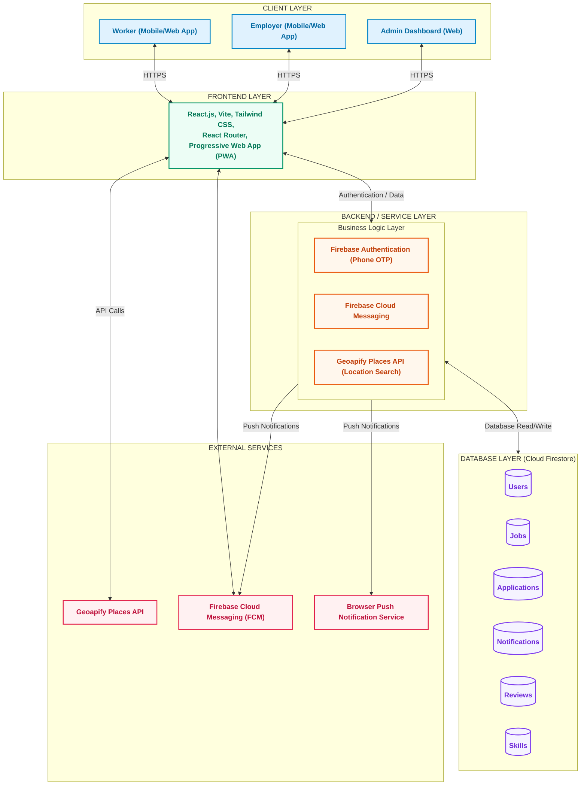

# System Architecture - WorkLink / Jobink

This document presents the cleaned system architecture diagram and workflow for the **WorkLink (Jobink)** hyperlocal part-time job marketplace. All detailed component responsibilities have been removed to provide a clean, high-level structural overview.

---

## 1. Interactive Mermaid Diagram

Below is the clean architecture diagram representing the layered structure, external integrations, and database collections:

---

## 2. Core Architectural Layers

1. **Client Layer**: Accessible interfaces for users (Workers and Employers) and platform administrators (Admin Dashboard).
2. **Frontend Layer**: Built using React.js and Vite. It is compiled as a Progressive Web App (PWA) for native-like performance on mobile devices.
3. **Backend / Service Layer**: Handles authentication verification, location APIs, and notification management.
4. **Database Layer**: A Cloud Firestore Database structured with six collection documents: `Users`, `Jobs`, `Applications`, `Notifications`, `Reviews`, and `Skills`.
5. **External Services**: Integrated third-party APIs for mapping, geolocation routing, and push notification messaging.

---

## 3. Workflow Sequence

Below is the linear workflow indicating how a job progresses from creation to payment:

```mermaid
graph LR
    classDef step fill:#f8fafc,stroke:#475569,stroke-width:1.5px,color:#0f172a;
    
    W_Browse["Worker Browses Jobs"]:::step --> Apply["Apply"]:::step
    Apply --> E_Accept["Employer Accepts"]:::step
    E_Accept --> W_Start["Work Started"]:::step
    W_Start --> W_Complete["Work Completed"]:::step
    W_Complete --> E_Pay["Employer Marks Paid"]:::step
    E_Pay --> W_Confirm["Worker Confirms Payment"]:::step
```

---

## 4. Visual Diagram Mockup

Below is a generated visual mockup of the clean system architecture diagram:

